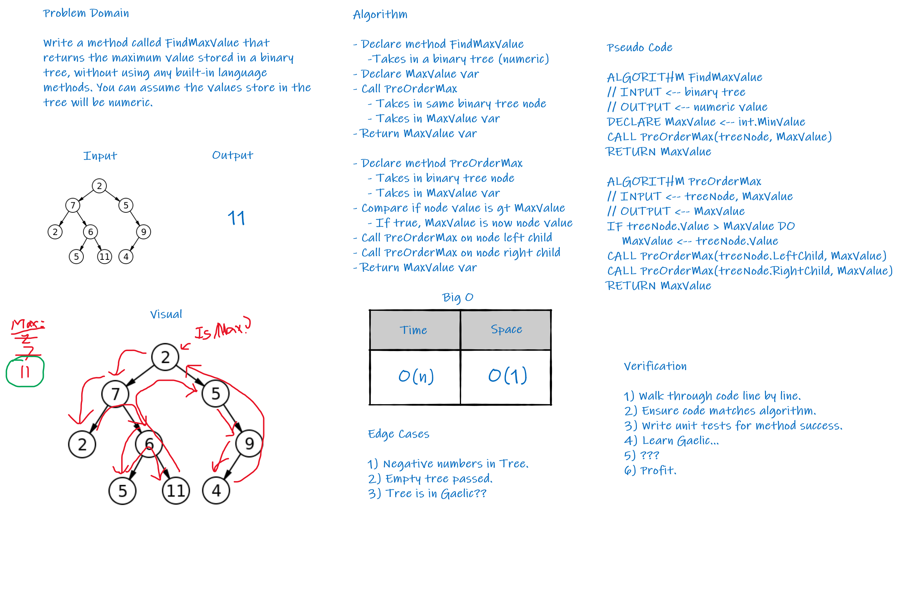

# FindMaxBinaryTree

Code Fellows 401 .NET Course - Code Challenge 18  
_Author: [Robert James Nielsen](https://github.com/robertjnielsen)_

## Problem Domain

Write an instance method called `FindMaxValue`.

 Without utilizing any of the built-in methods available to your language, return the maximum value stored in the tree. You can assume that the values stored in the Binary Tree will be numeric.

## Inputs And Expected Outputs

#### Input (Example)

```cs
      2
    /   \
   7     5
  / \     \
 2   6     9
    / \    /
   5  11  4
```

#### Output (Example)

```cs
11
```

## Big O

|Time|Space|
|:---:|:---:|
|O(n)|O(1)|

Time is **O(n)** because the method has to traverse through the entire tree to determine which node holds the maximum value.

Space is **O(1)** because nothing new is being instantiated into memory.

## Whiteboard Visual



## Change Log

**1.1** - 20200409
- Whiteboard image added to documentation.
- Whiteboard complete.

**1.0** - 20200409
- Created documentation.
- Created Test Project files.
- Created Solution / Project files.