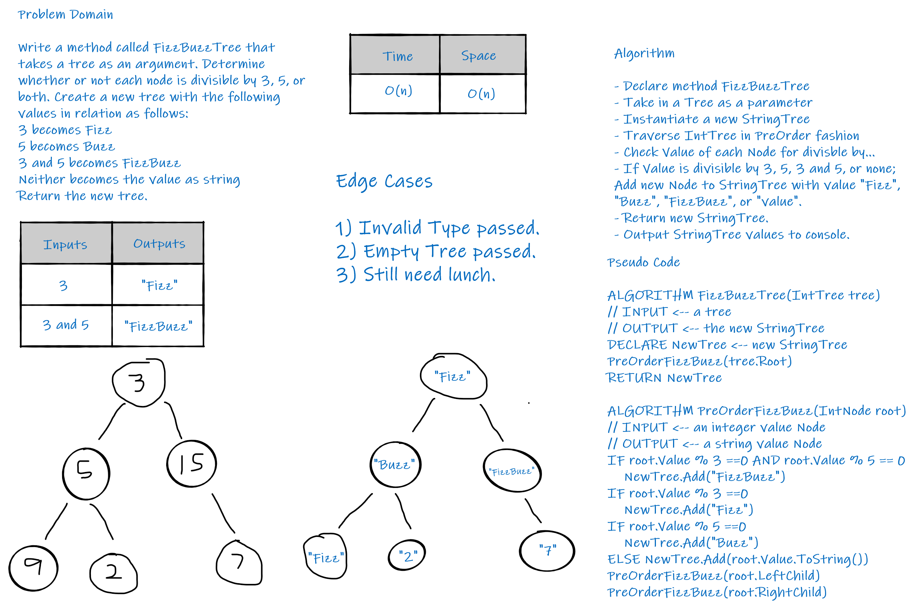

# FizzBuzzTree

_Author: [Robert James Nielsen](https://github.com/robertjnielsen)_

## Problem Domain

Write a function called FizzBuzzTree which takes a tree as an argument.

Without utilizing any of the built-in methods available to your language, determine whether or not the value of each node is divisible by 3, 5 or both. Create a new tree with the same structure as the original, but the values modified as follows:
- If the value is divisible by 3, replace the value with “Fizz”
- If the value is divisible by 5, replace the value with “Buzz”
- If the value is divisible by 3 and 5, replace the value with “FizzBuzz”
- If the value is not divisible by 3 or 5, simply turn the number into a String.

Return the new tree.

## Inputs And Outputs

#### Input

```cs
    7
   / \
  4   10
 / \    \
3   5   15
```

#### Output

```cs
           "7"
          /   \
        "4"    "Buzz"
       /   \        \
  "Fizz"  "Buzz"   "FizzBuzz"
```

## Big O & Efficiency

|Time|Space|
|:---:|:---:|
|O(n)|O(n)|

This solution has an **O(n)** efficiency for both Time and Space, because it has to traverse through every Node in the first Tree, as well as instantiate a new Tree, and a new Node for each existing Node in the first Tree.

## Whiteboard Visual



## Change Log

**1.2** - 20200407
- First (unsuccessful) pass at solving.

**1.1** - 20200407
- Created classes:
  - Node class.
  - IntTree class.
  - StringTree class.

**1.0** - 20200407
- Created Solution / Project files.
- Created Whiteboard image.