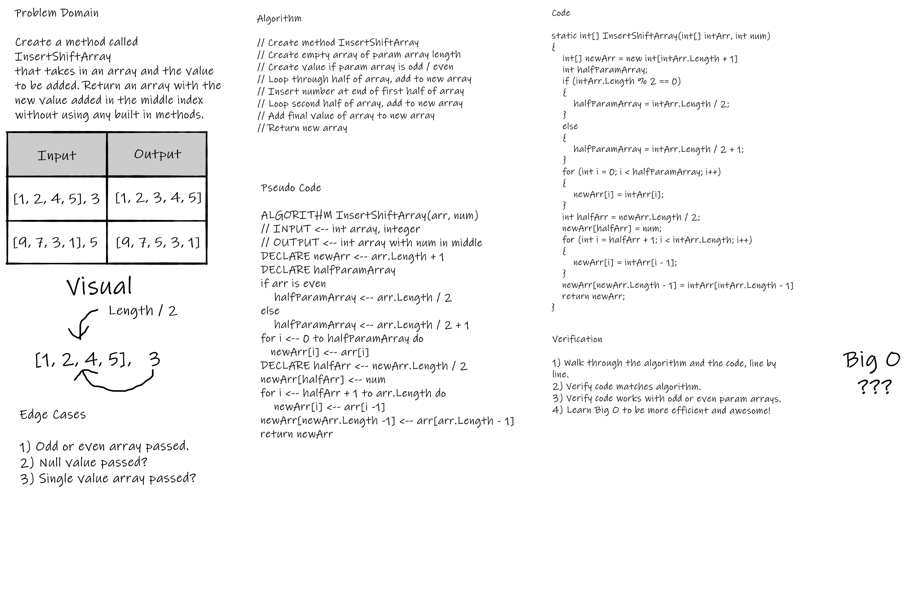

# InsertShiftArray
_Author: [Robert James Nielsen](https://github.com/robertjnielsen)_

## Problem Domain
Write a method called **InsertShiftArray** that takes in an array of integers, and a single integer. This method should place the single integer into the array at its middle index, and return the array, without using built in C# or .NET methods.

## Inputs & Expected Outputs
|Input|Output|
|:---:|:---:|
|[1, 2, 4, 5], 3|[1, 2, 3, 4, 5]|
|[1, 3, 5, 9, 11], 7| [1, 3, 5, 7, 9, 11]|

## Big O
While I still haven't learned, and don't fully understand Big O and efficiency, I feel that this problem could be solved in a more efficient manner. I feel this way because it seems to me that it takes more steps than it probably should. I'm guessing that would be a time factor in Big O notation.

## Whiteboard Visual

## Change Log
**1.2** - 20200318
- Completed README / documentation.

**1.1** - 20200318
- Completed code challenge.

**1.0** - 20200318
- Created project / solution files.
- Created whiteboard solution / image.