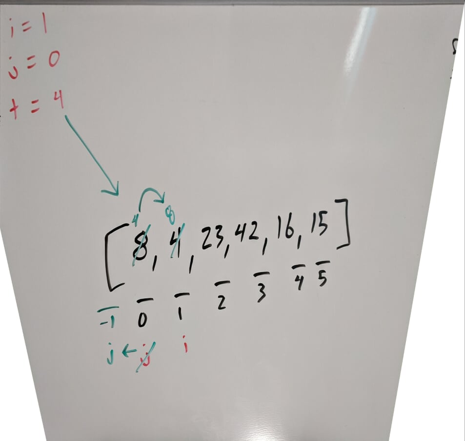
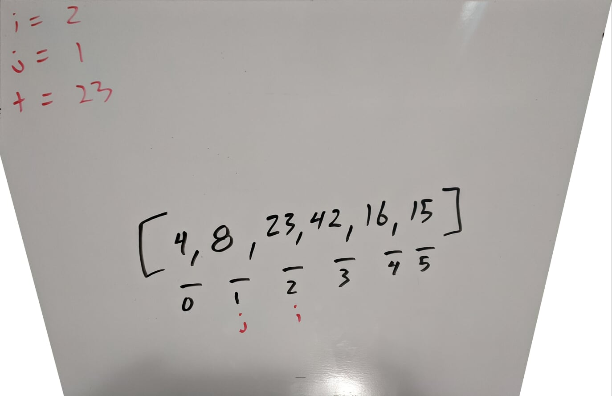
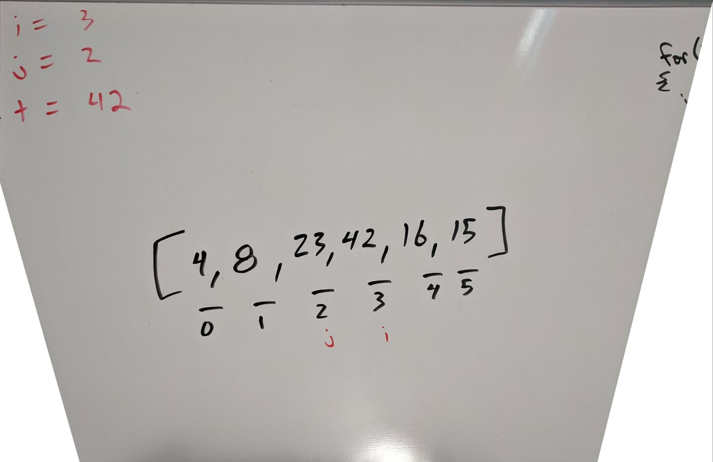
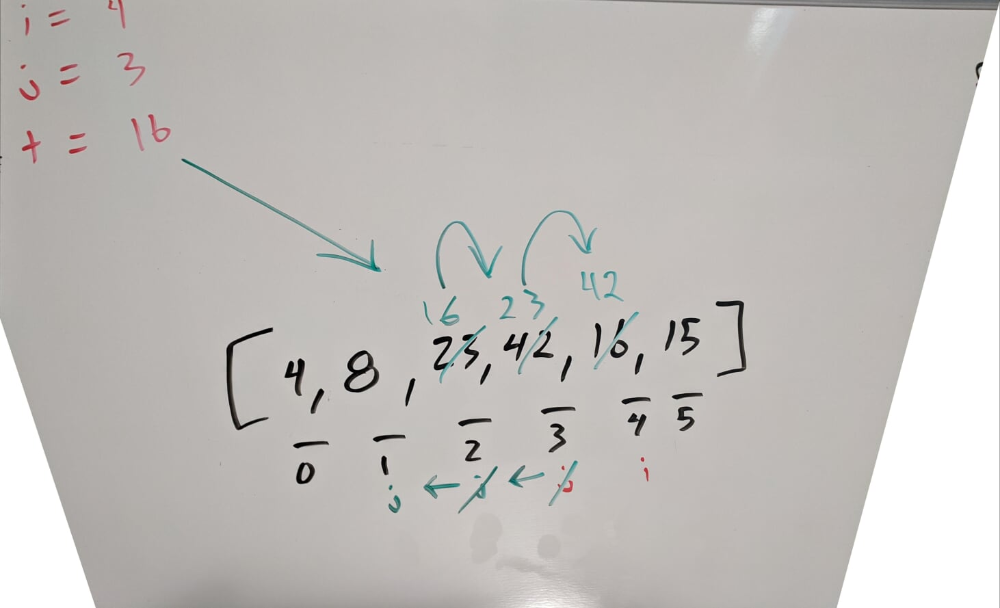
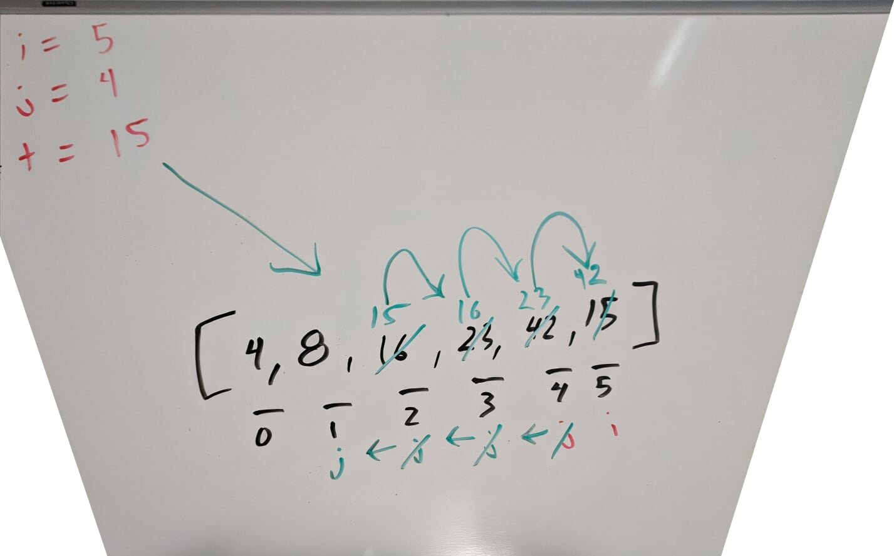

# Insertion Sort

_Author: [Robert James Nielsen](https://github.com/robertjnielsen)_

## What Is Insertion Sort?

Insertion Sort is a sorting algorithm that takes in an unsorted array and builds a final sorted array one element at a time. The algorithm keeps track of a temporary value within the array, and compares it to all values in the array before it until it finds a value that is not greater than it. It then moves all values between that discovered index and the current index of the temporary value forward by one. This process is repeated until the entire array has been traversed.

## Pseudo Code

```cs
InsertionSort(int[] arr)

	FOR i = 1 TO arr.Length
		
		int j <-- i - 1
		int tmp <-- arr[i]
		
		WHILE j >= 0 AND tmp < arr[j]
			arr[j + 1] <-- arr[j]
			j <-- j - 1

		arr[j + 1] <-- tmp

	RETURN arr

```

## Trace

Sample Input Array: `[8, 4, 23, 42, 16, 15]`

Pass 1:



In this first iteration, `tmp` is equal to the value of `arr[i]`, which is `4`. Our `while` loop then hits as `true`, which causes the value of `arr[j]` (8) to take the current place of `arr[i]`, and we decrement our variable `j` by one. Since `j` is less than `0`, our `while` loop can no longer run, and we move on to set the value of `arr[j + 1]` to the value of `tmp`.

TLDR; The **8** and the **4** have swapped spots.



In our second iteration, our `while` loop does not strike as `true`, so nothing changes. Moving forward...



In our third iteration, our `while` loop conditional is still `false` so we move on again.



For our fourth iteration, our `while` loop conditional strikes as `true` for two interations, causing the values of `42` and `23` to both shift forward one index, and placing the `tmp` value of `16` in the index that `23` previously held. At this point, all values in the array are sorted but the last.



For our fifth and final iteration we note that our current `tmp` value of `15` is less than the three values before it, thus causing our `while` loop conditional to read as `true` for three iterations. This shifts the values of `42`, `23`, and `16` forward one index each, and places our `tmp` value of `15` in the index that was previously held by `16`.

The result of this final iteration is a final sorted array as our output:
```
[4, 8, 15, 16, 23, 42]
```

## Efficiency

- Time: Insertion Sort is an **O(n^2)** complexity because it has to traverse the entire array, as well as find out how many spaces each element needs to be shifted.
- Space: Insertion Sort is an **O(1)** operation because nothing new is being instantiated in memory aside from reference values which are cleaned after the operation completes and returns the sorted array.