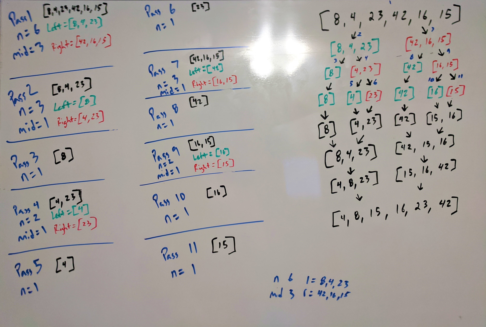

# Merge Sort

_Author: [Robert James Nielsen](https://github.com/robertjnielsen)_

## What Is Merge Sort?

Merge Sort is a **divide and conquer** algorithm. This means that it takes the original problem, and continuously divides it into smaller problems via recursion.

Once the base case has been hit (meaning we can no longer divide the problems down), we then begin to solve the smaller problems, working our way back up through these solutions to the final solution of the original problem.

In regards to Merge Sort, it takes an array, and continuously divides the array down. Once the base case has been reached, it will sort and merge those smaller arrays, working its way back up until the original array has been sorted and solved.

## Pseudo Code

```cs
ALGORITHM MergeSort(arr)
  DECLARE n <-- arr.length

  IF n > 1
    DECLARE mid <-- n / 2
    DECLARE left <-- arr[0...mid]
    DECLARE right <-- arr[mid...n]
    MergeSort(left)
    MergeSort(right)
    Merge(left, right, arr)


ALGORITHM Merge(left, right, arr)
  DECLARE i <-- 0
  DECLARE j <-- 0
  DECLARE k <-- 0

  WHILE i < left.length AND j < right.length
    IF left[i] <= right[j]
      arr[k] <-- left[i]
      i <-- i + 1
    ELSE
      arr[k] <-- right[j]
      j <-- j + 1

    k <-- k + 1

  IF i = left.length
    FOR x <-- k TO arr.length
      arr[x] <-- right[j]
      j <-- j + 1
  ELSE
    FOR x <-- k TO arr.length
      arr[x] <-- left[i]
      i <-- i + 1
```

## Trace

#### Merge Sort Trace Whiteboard


In this image, you can see that as the method is recursively calling itself, each iteration tracks the current values of `n`, `mid`, `left` and `right`.

With each iteration and call to the stack the `left` and `right` arrays are being split (as shown in the Passes on the left, and the diagram on the right) until the base case has been reached of just one element left per array.

At this point the Merge method picks up and begins to rebuild the arrays, sorting as it goes.

## Efficiency

**Time**: O(_n_ log _n_)
- This is due to the algorithm having to work through every element in the array, however it is reducing the size of the array in half each time it has to work with it, thus reducing the amount of work to complete each iteration.

**Space**: O(_n_)
- This is becuase the array has to instantiate the number of temporary values / arrays in relation to each iteration required to fully reach the base case and start working its way back through the merge portion of the solution.
