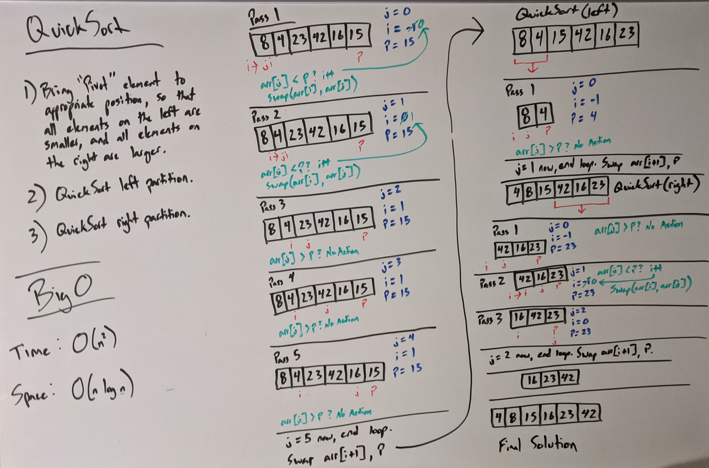

# Quick Sort

## What Is Quick Sort?

Quick Sort is a sorting algorithm. It is considered a Divide and Conquer algorithm, and is also a recursive algorithm.

Quick Sort works by assigning an index in the array as the Pivot for comparison and partition of the array to be called upon recursively.

Each element in the array up to the pivot is compared to the Pivot to determine its order in the array. Once the array has been looped over, the Pivot winds up in the correct location where all elements to its left are smaller than it, and all elements to its right are larger. It is at this point that the method is called recursively on itself, first with the left partition, and then the right.

This process repeats until the entire array has been sorted and the final solution achieved.

## Pseudo Code

```cs
ALGORITHM QuickSort(arr, left, right)
  IF left < right
    DEFINE position <-- Partition(arr, left, right)
    QuickSort(arr, left, position - 1)
    QuickSort(arr, position + 1, right)

ALGORITHM Partition(arr, left, right)
  DEFINE pivot <-- arr[right]
  DEFINE i <-- left - 1
  FOR j <-- left TO right DO
    IF arr[j] <= pivot
      i <-- i + 1
      Swap(arr, j, i)
  Swap(arr, right, i + 1)
  RETURN i + 1

ALGORITHM Swap(arr, j, i)
  DEFINE tmp
  tmp <-- arr[j]
  arr[j] <-- arr[i]
  arr[i] <-- tmp
```

## Trace



As the QuickSort method runs through each iteration (or Pass) it compares the elements in the array to the Pivot element (chosen as the last element in this case). If the current element is less than the Pivot, we increment our low counter `i` and then swap the elements in the locations of `i` and `j` (our iteration counter).

If those elements are larger than the Pivot, nothing happens and we continue the to the next iteration.

After the loop has reached the end of the array and breaks, we then swap our Pivot element with the element located at the index of `i + 1`. This ensures that everything to the left of our Pivot is less than the element, and everything to the right is more than the element.

Finally, we recursively call our QuickSort method on the left, then right partitions of the array and the process continues until the final solution is reached.

## Efficiency

- Time: QuickSort is an **O(n^2)** operation for time at its worst case because it has to iterate through each element, and this could be dependent upon which elements are in place before the Pivot element.

- Space: QuickSort is an **O(_n_ log _n_)** operation for space, because as a Divide and Conquer algorithm, it is not requiring any additional space on the call stack, and reduces the amount of references created per operation in this fashion.