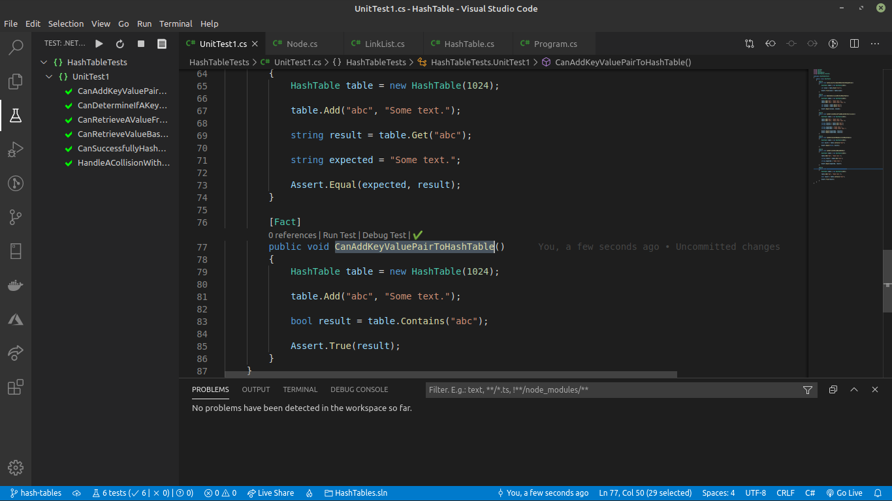
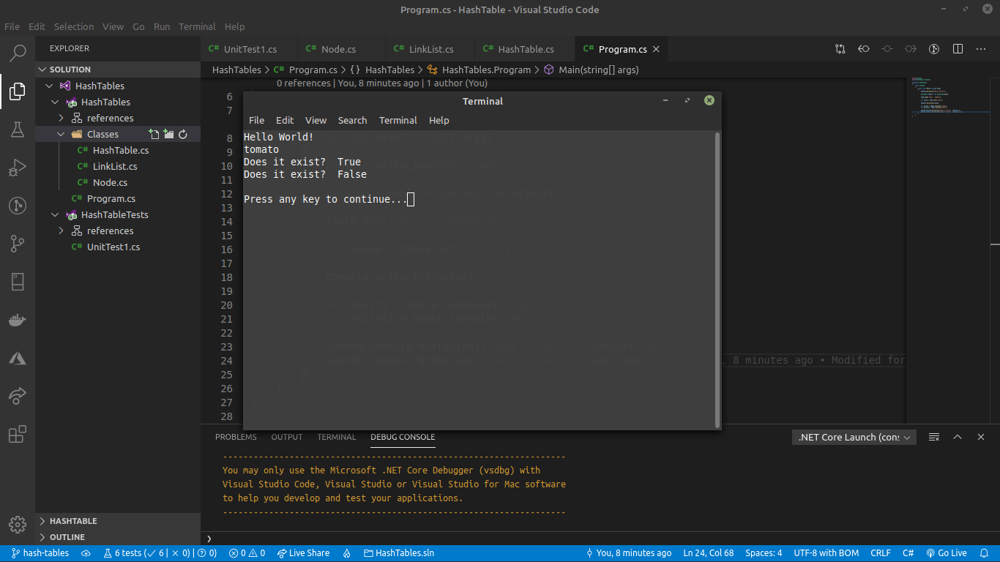

# Hash Table

_Author: [Robert James Nielsen](https://github.com/robertjnielsen)_

## Problem Domain

Implement a Hash Table with the following methods:
- `add` : takes in both the key and value. This method should hash the key, and add the key and value pair to the table, handling collisions as needed.
- `get` : takes in the key and returns the value from the table.
- `contains` : takes in the key and returns a boolean, indicating if the key exists in the table already.
- `hash` : takes in an arbitrary key and returns an index in the collection.

## Inputs And Expected Outputs

#### Input
|Key|Value|
|:---:|:---:|
|"abc"|"Some text."|

#### Output
|Index|Data|
|:---:|:---:|
|[0]|["abc" -> "Some text."]|
|[1]|[null]|
|[2]|[null]|
|[3]|[null]|
|[4]|[null]|
|[5]|[null]|
|[6]|[null]|

## Big O

|Time|Space|
|:---:|:--:|
|O(1)|O(1)|

## Visuals

**_Whiteboard not required._**

#### All Tests Passed

#### Program File

#### Program Running

## Change Log

**1.0** - 20200427
- Challenge complete.
- Documentation complete.

**0.9** - 20200427
- Program images added.

**0.8** - 20200427
- `Program.cs` file refactored / complete.

**0.7** - 20200427
- All unit tests complete.

**0.6** - 20200427
- `Program.cs` file refactored.

**0.5** - 20200427
- `Contains()` method complete.

**0.4** - 20200427
- `Get()` method complete.

**0.3** - 20200427
- `Add()` method complete.

**0.2** - 20200427
- `Hash()` method complete.

**0.1** - 20200427
- Node class created.
- LinkList class created.
- HashTable class created.
- Solution / Project files created.