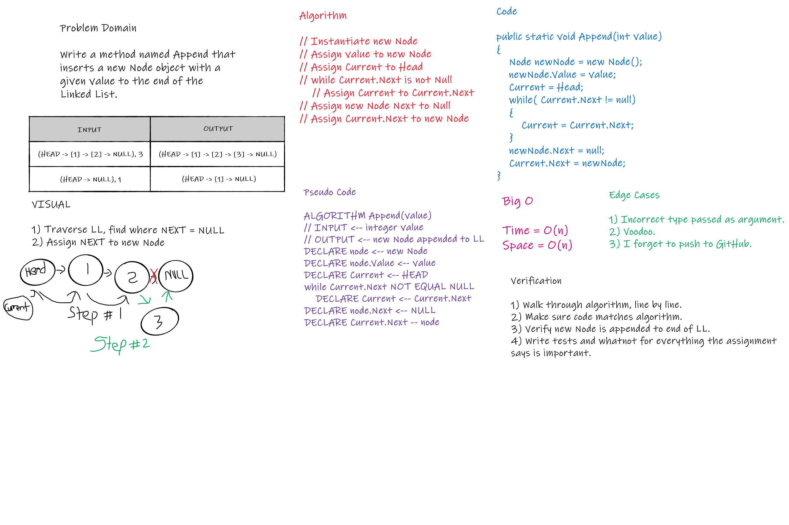

# Linked List Implementation
Code Fellows 401 .NET - Code Challenge 05  
_Author: [Robert James Nielsen](https://github.com/robertjnielsen)_

## Problem Domain
To learn about Linked Lists, we were to create our own implementation of a Linked List. The (high-level) requirements were as such:
- Create a Node class that has properties for the value stored in the Node, and a reference to the next Node.
- Within your LinkedList class, include a head property. Upon instantiation, an empty Linked List should be created.
- Define a method called `Insert` which takes any value as an argument, and adds a new node with that value to the head of the list with an O(1) Time performance.
- Define a method called `InsertAfter` which takes two values as an argument, and adds a new Node to the Linked List after a specified Node.
  - The first argument passed is the value of the Node to insert after.
  - The second argument passed is the value of the new Node to be inserted.
- Define a method called `Append` which takes in an integer value, and instantiates a new Node object with that value. The new Node will then be appended to the end of the Linked List.
- Define a method called `InsertBefore` which takes two values as an argument, and adds a new Node to the Linked List before a specified Node.
  - The first argument passed is the value of the Node to insert before.
  - The second argument passed is the value of the new Node to be inserted.
- Define a method called `Includes` which takes any value as an argument, and returns a boolean result depending on whether that value exists as a Node’s value somewhere within the list.
- Define a method called `ToString` which takes in no arguments, and returns a string representing all the values in the Linked List, formatted as:
	- `"valA -> valB -> valC -> NULL"`

## Inputs And Expected Outputs
Inputs and outputs are method dependant.
- Inputs generally consist of integer values to represent Node values.
- Outputs are the instantiation of new Node objects being added to the Linked List in most methods.
  - `Includes()` outputs a boolean value if Node with value exists in the Linked List.
  - `ToString()` outputs a string representing the Linked List to the console.

## Big O

#### Insert() Method

|Time|Space|
|:---:|:---:|
|O(1)|O(n)|

Time is **O(1)** becuause this `Insert()` method will always insert a new Node object at the beginning of the Linked List, no matter the size of the Linked List.

Space is **O(n)** because the method will create and insert one new Node object into the Linked List, as defined in the method parameters.

#### InsertBefore() Method

|Time|Space|
|:---:|:---:|
|O(n)|O(n)|

Time is **O(n)** becuase the method has to traverse as many Node objects in the Linked List as neccessary to find the correct Node to insert before.

Space is **O(n)** becuase the method will create and insert one new Node object into the Linked List, as defined in the method parameters.

#### InsertAfter() Method

|Time|Space|
|:---:|:---:|
|O(n)|O(n)|

Time is **O(n)** becuase the method has to traverse as many Node objects in the Linked List as neccessary to find the correct Node to insert after.

Space is **O(n)** becuase the method will create and insert one new Node object into the Linked List, as defined in the method parameters.

#### Append() Method

|Time|Space|
|:---:|:---:|
|O(n)|O(n)|

Time is **O(n)** becuase the method has to traverse all Node objects in the Linked List as neccessary to find the last Node to insert after.

Space is **O(n)** becuase the method will create and append one new Node object into the Linked List, as defined in the method parameters.

#### Includes() Method

|Time|Space|
|:---:|:---:|
|O(n)|O(1)|

Time is **O(n)** because it doesn't matter if the Linked List contains 1 or 100 Node objects, the method will have to traverse through each of those objects within the List sequentially until it finds a matching value (if the value exists).

Space is **O(1)** because the method is not instantiating or adding any new data to memory.

#### ToString() Method

|Time|Space|
|:---:|:---:|
|O(n)|O(n)|

Time is **O(n)** because it doesn't matter if the Linked List contains 1 or 100 Node objects, the method will have to traverse through each of those objects within the List sequentially to append all values to the StringBuilder instance.

Space is **O(n)** because the method is adding a new StringBuilder instance to memory.

## Whiteboard Visual

The requirement for this challenge was to whiteboard one of the methods in the set. I chose to whiteboard the `Append()` method.

## Change Log

**1.3** - 20200324
- Documentation complete to current version.
- All relevant method tests passed.
- Append, InsertBefore and InsertAfter methods complete.
- Whiteboard visual complete for Append method.

**1.2** - 20200323
- Documentation complete to current version.
- All relevant method tests passed.
- Insert, Includes, and ToString methods complete.
- Node and LinkList classes created.

**1.1** - 20200322
- Test project created.

**1.0** - 20200322
- Project / solution files created.
- Repository initialized.

