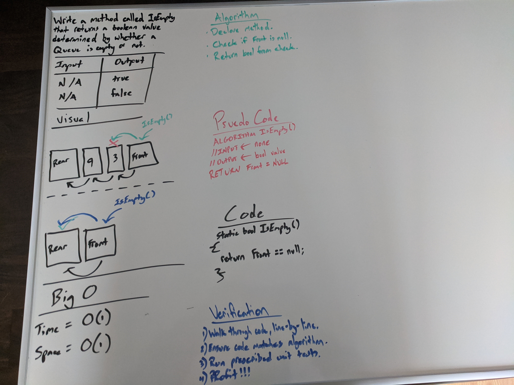

# Stacks And Queues

Code Fellows 401 .NET - Code Challenge 10  
_Author: [Robert James Nielsen](https://github.com/robertjnielsen)_

## Problem Domain

To learn about Stacks and Queues, we were to create our own implementation of each with the following requirements:
- Create a `Node` class that has properties for the value stored in the Node, and a pointer to the next node.
- Create a `Stack` class that has a top property. It creates an empty Stack when instantiated.
  - This object should be aware of a default empty value assigned to `top` when the stack is created.
  - Define a method called `push` which takes any value as an argument and adds a new node with that value to the `top` of the stack with an O(1) Time performance.
  - Define a method called `pop` that does not take any argument, removes the node from the top of the stack, and returns the node’s value.
    - Should raise exception when called on empty stack.
  - Define a method called peek that does not take an argument and returns the value of the node located on top of the stack, without removing it from the stack.
    - Should raise exception when called on empty stack.
  - Define a method called isEmpty that takes no argument, and returns a boolean indicating whether or not the stack is empty.
- Create a Queue class that has a front property. It creates an empty Queue when instantiated.
  - This object should be aware of a default empty value assigned to front when the queue is created.
  - Define a method called enqueue which takes any value as an argument and adds a new node with that value to the back of the queue with an O(1) Time performance.
  - Define a method called dequeue that does not take any argument, removes the node from the front of the queue, and returns the node’s value.
    - Should raise exception when called on empty queue.
  - Define a method called peek that does not take an argument and returns the value of the node located in the front of the queue, without removing it from the queue.
    - Should raise exception when called on empty queue.
  - Define a method called isEmpty that takes no argument, and returns a boolean indicating whether or not the queue is empty.

## Inputs And Expected Outputs

Inputs and outputs are method dependant:
- `Push` and `Enqueue` both take in an integer value to be used as the value of the new `Node` they each create.
- `Pop` and `Dequeue` both return an integer value as the `Value` of the `Node` they are removing.
- `Peek` returns an integer value as the `Value` of the `Top` or `Front` nodes respectively.
- `IsEmpty` returns a boolean value dependant upon whether the Stack or Queue is empty or not.

## Big O

All methods are of the same Space and Time efficiency.

|Time|Space|
|:---:|:---:|
|O(1)|O(1)|

## Whiteboard Visual

## Change Log

**1.3** - 20200330
- Documentation complete to current version.

**1.2** - 20200330
- Queue unit tests passed.
- Stack unit tests passed.

**1.1** - 20200330
- Queue class created.
- Stack class created.
- Node class created.

**1.0** - 20200330
- Project / solution files created.
- Whiteboard complete.