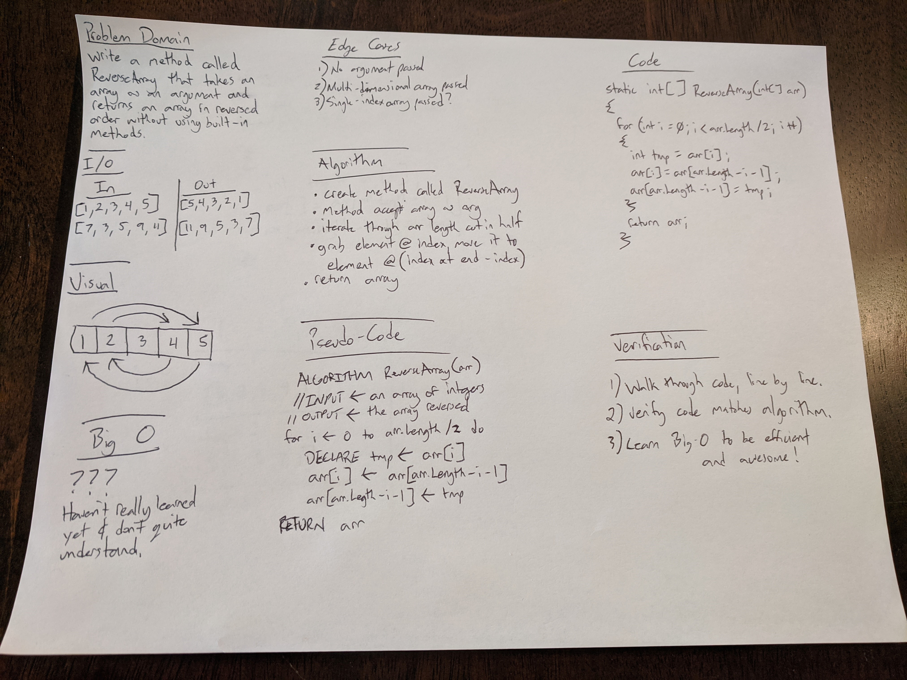

# ArrayReverse
_Author: [Robert Nielsen](https://github.com/robertjnielsen)_

## Problem Domain
Write a method called **ReverseArray** that takes in an integer array as an argument. This method should reverse the order of the elements in the array without using built-in C# methods, and return the reversed array.

## Inputs & Expected Outputs
|            Input            |            Output           |
|:---------------------------:|:---------------------------:|
|       [1, 2, 3, 4, 5]       |        [5, 4, 3, 2, 1]      |
|        [2, 5, 1, 7]         |         [7, 1, 5, 2]        |
| [1, 9, 4, 2, 6, 3, 2, 5, 2] | [2, 5, 2, 3, 6, 2, 4, 9, 1] | 

## Big O
We'll get there, still learning Big O / Time & Space efficiency.

## Whiteboard Visual

## Change Log
**1.0**: 20200317
- Created Project
- Added ArrayReverse.md file