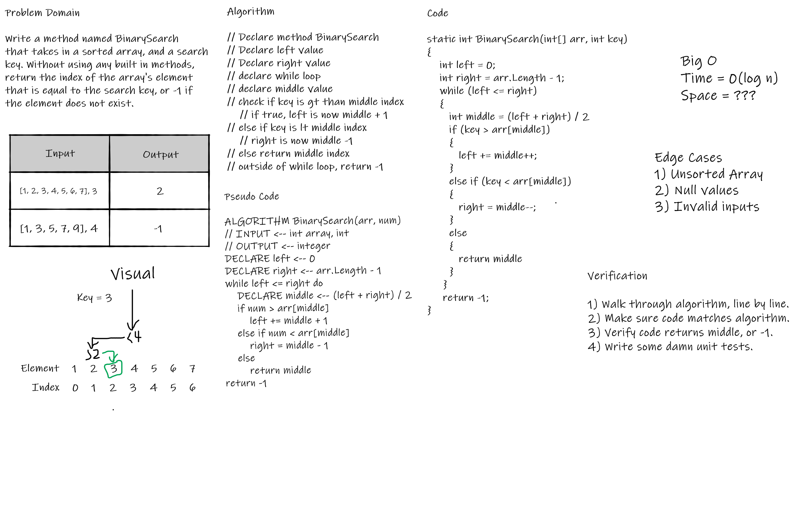

# BinarySearch

_Author: [Robert James Nielsen](https://github.com/robertjnielsen)_

## Problem Domain

Write a method named BinarySearch that takes in an integer array, and an integer search key. Without using any built-in C# methods, return the index of the element that matches the search key. If the element does not exist, return `-1`.

## Inputs & Outputs

|Input|Output|
|:---:|:---:|
|[1, 2, 3, 4, 5, 5, 7], 3| 2|
|[1, 3, 5, 7, 9, 11, 13], 4|-1|

## Big O & Efficiency

At this time, I'm still learning about Big O notation. I have learned that this algorithm is consisered `O(log n)` for time though, as each pass through the array, it removes half of the array, thus diving the work in two each time it iterates.

I still have a lot to learn about Big O at this time.

## Whiteboard Visual

## Change Log

**1.3** - 20200319
- Completed README / documentation.

**1.2** - 20200319
- Completed unit tests for challenge.

**1.1** - 20200319
- Completed code challenge.

**1.0** - 20200319
- Created Project / Solution files.
- Created whiteboard image.